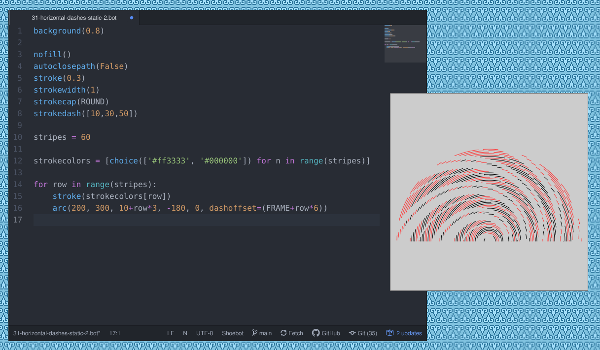

Extensions
==========

There are a few plug-ins and extensions that make for a much better experience.

.. _atom-extension:

Atom extension
--------------

`Atom <https://atom.io>`_ is an excellent free software code editor, and there
is a `Shoebot package <https://github.com/shoebot/atom-shoebot>`_ that turns it
into the ideal tool to experiment with Shoebot.

Install it as you would any other Atom package: go to Preferences, Install and
search for the "shoebot" package. Once installed, you get these extra commands:

- Run (``Ctrl-Alt-R``): Run the open sketch on a window
- Export (``Ctrl-Alt-E``): Run and save the output to a file (SVG, PNG or PDF)
- Export video: Run and save to an MP4 file

Be sure to check the extension options to set the location of your Shoebot
installation.

Gedit plugin
------------

This Gedit plugin adds a menu to allow for running Shoebot scripts. It will open
a Shoebot window using the current document as the Shoebot code.

Run the following commands to add the plugin to Gedit::

    cd shoebot/extensions/gedit
    python3 install.py

Now restart Gedit. Navigate to ``Edit > Preferences > Plugins`` and activate the
Shoebotit plugin.

TODO: document plugin usage
