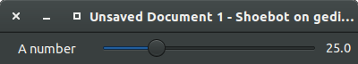

Live Variables
==============

Shoebot is not limited to what you write inside your .bot file; you can open
your sketch for receiving and reacting to data from outside applications and
environments.

These can be created using the :py:func:`var` command.

Using the live variables GUI
----------------------------

When a script uses the `var` keyword, the corresponding widget will appear in
the live variables GUI.

The following code will make a slider with a minimum value of 0, a maximum
value of 100, and an initial (default) value of 25.

.. code-block:: python

        var('a_number', NUMBER, 25., 0., 100.)

Setting variables in the command line
-------------------------------------

Live variables can be set from the commandline using JSON syntax:

.. code-block:: bash

    $ sbot --vars='{ "hue": 32 }' examples/vars/circle_circle.bot

This means that a Shoebot script can be called with different parameters without having to change the script itself -- just specify the live variable initial values with ``--vars``. 

Socket server
-------------

If shoebot is run with the `--serverport` option, a socket server will also be
started. Socket servers can accept connections from other applications or even
across the network in order to set variables inside running Shoebot scripts. 

.. code-block:: bash

    $ sbot -s examples/animation/hypnoval.bot
    Listening on port 7777...

Once it's running, it's easy to connect with telnet:

.. code-block:: bash

    $ telnet 127.0.0.1 7777

This gets you into the shell, where you can use the commands below to list and set variables, rewind and go to frames. 

The following commands can also be sent through other applications like Pure Data; there is a simple PD example in ``examples/socketcontrol/helloworld.pd``.  Be sure to take a look at the socket server examples in action inside the `examples/socketserver` directory.

Socketserver commands
^^^^^^^^^^^^^^^^^^^^^

    ==================   ======================================
    Command              Description
    ==================   ======================================
    goto 100             go to frame 100
    pause                pause playback
    rewind               set FRAME to 0
    restart              set FRAME to 0 and reset all variables
    vars                 show content of all live variables
    set n=1              set variable 'n' to value 1
    n=1                  set variable 'n' to value 1
    help                 show list of all commands
    ==================   ======================================

.. _shell-mode:

Using the live shell
--------------------

Shoebot provides a live shell for communication with text editors, as well as livecoding.

All the socket server commands above are available, along with ``load_base64`` which allows livecoding.

To experiment with the shell, run an example with the ``-l`` option:

.. code-block:: bash

    $ sbot -l examples/animation/hypnoval.bot

The shell accepts all the socket server commands, along with a couple more; these can be useful for an editor or IDE.

Live Shell commands
^^^^^^^^^^^^^^^^^^^

    ==================   ==============================================
    Command              Description
    ==================   ==============================================
    quit                 quit shoebot
    load_base64          used by IDE/Editor to send new code to Shoebot
    ==================   ==============================================

